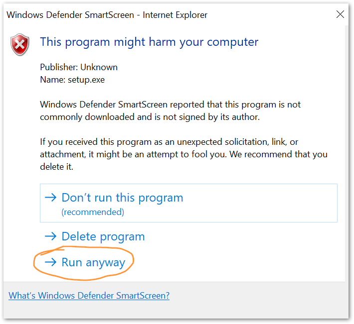

% Integrated Air Information Platform

The IAIP is used by the Georgia EPD to collect and organize data required by the Air Protection Branch. Documentation can be found on the [IAIP Documentation site](https://sites.google.com/site/iaipdocs/).

## Support

For account management and general application support, please contact your supervisor in EPD or Sean Taylor. To report an error or bug, please create an EPD-IT Support Ticket.

## Installation

Click this button to download and run the setup file.

[Download the
IAIP Installer](install/IAIP.application)

The installer does **not** require admin permissions. You will likely get one or more security alerts such as those shown below when you run the installer. Click the "More info" or "More options" link, then click the button labeled "Run anyway".

 

 

## Connecting remotely

The IAIP may be used from remote locations (outside of EPD offices) *only* by connecting through the DNR VPN. [Instructions for accessing the VPN](https://dnrintranet.org/vpn) are available on the DNR Intranet.

Your username and password for the VPN are the same as the ones you use to log in to your work computer (not the same as your IAIP username/password).

## What's New

See the [change log](changelog/).

## License

The IAIP is Copyright © Georgia Air Protection Branch. This product is licensed only to employees of the State of Georgia.
