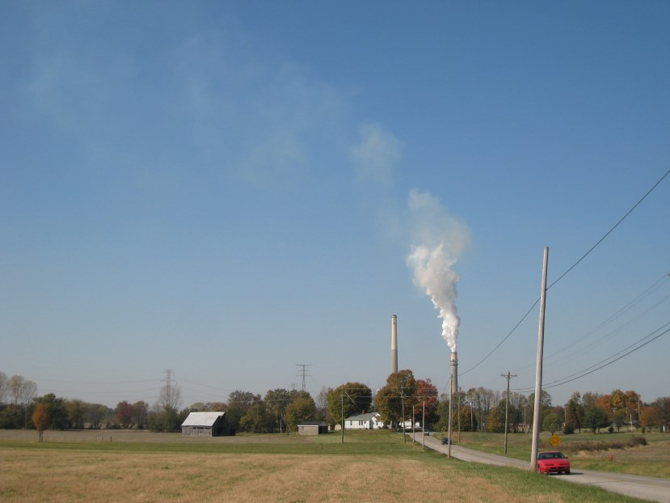

% IAIP: What's New -- 2017

*Previously:* [2016](changelog-2016.html) | [2015](changelog-2015.html) | [2014](changelog-2014.html) | [2013](changelog-2013.html)

## Version 5.5.3 (2017-12-20)

Bug fixes:

* ISMP was unable to print stack tests that were still open.
* Rare crash in SSCP FCE review data

## Version 5.5.2 (2017-12-19)

Bug fixes:

* SSCP was unable to enter compliance data for stack tests.
* ISMP test notifications were not opening correctly.
* Fixed some bugs in the Fee Audit Log.

## Version 5.5.0 (2017-12-15)

**"I can't drive 5.5" edition**

Lots of minor bug fixes and code maintenance in this release. Plus I added a new crash monitoring tool to make it easier to respond to problems in the future. Here's to fewer crashes in the new year! 💥⤵️ 🎉⤴️

Some of the improvements and bugs fixed:

* Boxes were mysteriously checked in the Facility Creator tool
* Event Registration tool will now include address info in the Excel export
* ISMP stack test wouldn't load correctly if the reference number had a leading zero
* Some older ISMP Method 9 tests wouldn't print
* SSCP Enforcement tool occasionally complained about bad dates that weren't actually bad 

## Version 5.4.3 (2017-12-06)

Moved GECO user management to a separate tool and fixed some bugs in the Fee tools.

## Version 5.4.2 (2017-12-01)

Fixed a few minor bugs including:

* Permit applications will correctly sort numerically again on the Navigation Screen
* Fixed a bug in the SSCP Enforcement form that caused the violation type to display incorrectly in rare circumstances

## Version 5.4.1 (2017-11-17)

Fixed a bug in the Title V Tools that caused too many emails to be generated.

## Version 5.4.0 (2017-11-07)

SSCP can now add multiple compliance discovery events to a single enforcement action.

Also, made it easier to find and fix bad registration information in the event registration tool.

## Version 5.3.6 (2017-10-27)

Fixed bugs in the Fee Statistics tool and the SSCP Managers tool

## Version 5.3.5 (2017-09-08)

Fixed bug in the EIS tool.

## Version 5.3.4 (2017-09-07)

Adjusted EIS tool layout

## Version 5.3.3 (2017-09-07)

Fixed some bugs in the EIS tools.

## Version 5.3.2 (2017-08-31)

Bugs fixed:

* Dates were displaying incorrectly in the ISMP Notification Log
* A permit application with no AIRS number would cause the IAIP to crash
* Newly entered enforcement stipulated penalties could not be deleted

## Version 5.3.1 (2017-07-28)

Fixed display of transactions in the Fee Audit Log

## Version 5.3.0 (2017-07-26)

Bug fixes:

* Deleted fee transactions no longer show up in the transaction list
* Fixed a bug in the Query Generator where the filter for Air Program Codes was not working

New features:

* A NAICS code is no longer required when updating an existing facility, only when creating a new facility (If a NAICS code is entered it will still be validated)
* The IAIP no longer cares if it has been open for more than 3 hours!

## Version 5.2.7 (2017-07-11)

Fixed a bug in IAIP fee audit.

## Version 5.2.6 (2017-07-10)

Fixed a bug where NSPS exemptions weren't saving.

## Version 5.2.5 (2017-06-27)

A few small bug fixes: 

* Couldn't leave URL field blank when creating a new Event
* Couldn't open permit directly from the Application Tracking Log

## Version 5.2.4 (2017-06-15)

Emergency release to fix a new bug introduced in the PA/PN Tool.

## Version 5.2.3 (2017-06-15)

Fixed errors in the PA/PN Tool.

Fixed saving new facility contact.

## Version 5.2.2 (2017-06-13)

Fixed date sorting in the SSPP Application Log.

Fixed SSCP ACC's not saving.

## Version 5.2.1 (2017-06-06)

Fixed ISMP test reports so test notification numbers can be directly entered.

## Version 5.2.0 (2017-06-02)

CMS Mega-sites are now enabled for SSCP facilities. 

Also, you can create an enforcement action directly from a compliance event again.

Bug fixes:

* Not all data saved when saving information requests in the SSPP Application Tracking Log
* A rare error message in the Emission Statement Tools
* Error when closing out a permit in SSPP Application Tracking Log
* Error when saving a new facility contact
* Error when choosing some fields to sort on in SSPP Application Log

## Version 5.1.1 (2017-05-26)

Just a couple bug fixes: 

* Incorrect program manager was saved for recent stack tests
* Acid rain permits not handled correctly in Title V Tools

## Version 5.1.0 (2017-05-15)

Now you can click "Remember me" when you log in and save time from typing your password every time you use the IAIP. There is also a new screen where you can see all your current saved logins and revoke any if necessary. (From the Navigation Screen, click on Account → Security.)

## Version 5.0.5 (2017-05-04)  Version 5.0.4 (2017-05-03)  Version 5.0.3 (2017-05-03)  Version 5.0.2 (2017-05-02)  Version 5.0.1 (2017-05-02)

Every major new release comes with its share of bugs. 🐛🐛🐛 

We've fixed the following and will continue with regular updates as we find more. If any of these has affected you, we are sorry for the inconvenience and thank you for your understanding...

* A bug that affected the ICIS-Air data exchange
* A bug that prevented saving changes to a SBEAP case log
* A bug that prevented saving changes to a SSCP notification log
* A bug that occurred when creating new facilities
* A bug that affected many ISMP report printouts
* A bug that prevented searching the Compliance Log by facility name
* A bug that occurred when opening applicattions with associated subpart data
* A bug that prevented all permit applications from showing up on the Navigation Screen when Unit View is selected

## Version 5.0 (2017-04-28) 🖐

The database infrastructure that powers the IAIP has been completely changed. This effort took over a year and a half of planning with many months of hard work by our crack application development team. There are many people to thank for the success of this project, but at the top of the list are the Air Branch staff who devoted valuable time and effort to test the new application. Without your help, this would not have been possible. Thank you!

Overall, IAIP functionality should be the same as before, though we did take the time to fix many bugs in the user interface and in the database connection code. You should experience a more stable, less error-prone connection when using the IAIP. Hopefully, you will not notice the improvement.

Please bear in mind that the IAIP is a large application (with over a quarter-million lines of code), and it was impossible to test all user scenarios. If you encounter a bug or error while using the program, please contact EPD-IT and we will address it as soon as possible. 

Thanks for all you do in service to the environment and the citizens of the State of Georgia! ♥

---

## Version 4.5.3 (2017-04-10)

* Fixed an error message that displayed when opening the SSPP Statistical Tool
* Fixed a bug that prevented printing out an ISMU "One Stack Two Run" test. Any guesses on how long this bug has existed? Submit your best guess by COB 14-Apr-17, and the closest wins a prize! (Prize has no cash value.)

## Version 4.5.2 (2017-03-21)

Fix a bug introduced in 4.5.2 that prevented emails from being sent from the IAIP.

## Version 4.5.1 (2017-03-09)

Added a check to prevent bad URLs in the Event Registration tool.

## Version 4.5.0 (2017-02-14)

Removed Smoke School tools. Thanks to everyone who has helped run Smoke School over the years and special thanks to Art Hollis!  

## Version 4.4.2 (2017-01-24)

Happy New Year! This release has just a few small fixes: a couple bugfixes in the EIS tools and better sorting for the new GACT and non-major NSPS subparts.